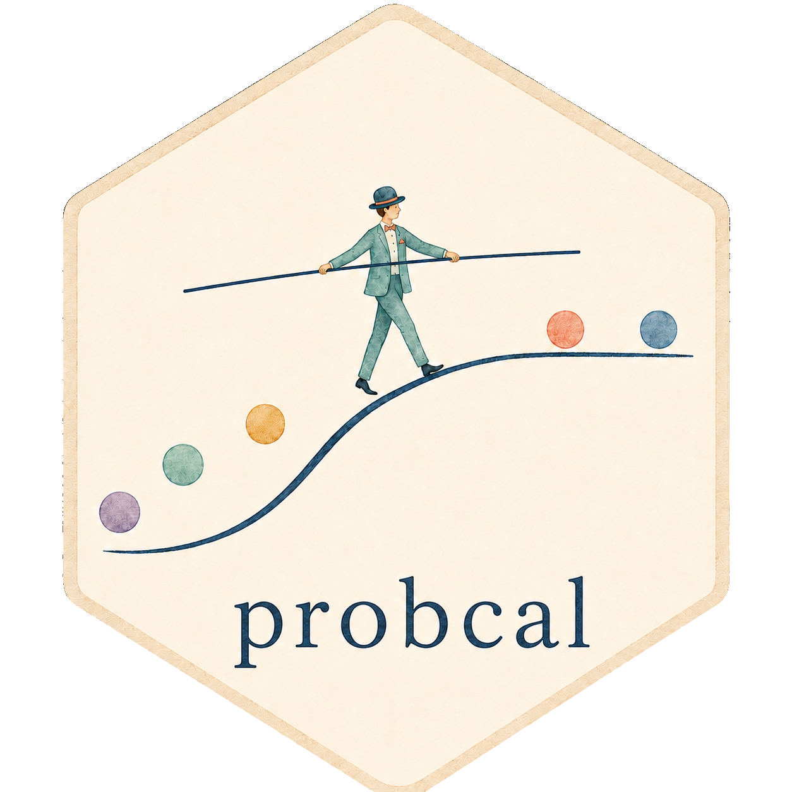

<!-- badges: start -->

[](https://github.com/prdm0/probcal/actions/workflows/R-CMD-check.yaml)
[](https://github.com/prdm0/probcal/blob/main/LICENSE)
[](https://prdm0.github.io/probcal/)
[](https://prdm0.r-universe.dev)
[](https://github.com/prdm0/probcal/releases)
[](https://www.r-project.org/)
[](https://lifecycle.r-lib.org/articles/stages.html#experimental)
<!-- badges: end -->

# probcal 

`probcal` calibrates predicted class probabilities after a classifier
has already been fitted. Many classifiers rank observations well but
assign probabilities that are too high, too low, or distorted in
different parts of the range. If observations predicted near 0.80 do not
occur about 80 percent of the time, the scores may still be useful for
ranking, but they are unreliable for decisions that use the probability
itself.

The package is designed for workflows where model fitting and
probability calibration are separate steps. Fit a binary or multiclass
classifier with any R modeling tool, reserve calibration data, and pass
the resulting scores, logits, or probability matrices to `probcal`.
Fitted calibrators are S3 objects: inspect them with `print()` or
`summary()` and apply them to new predictions with `predict()`.

Calibration is useful when predictions feed risk thresholds, triage
rules, forecasts, or decision analyses with unequal costs. `probcal`
provides post-hoc calibration methods, calibration metrics, reliability
diagrams, and out-of-fold calibration for settings where a separate
calibration split is small.

## What It Does

- Fits post-hoc calibrators for binary and multiclass probabilities.
- Works with scores, logits, probability vectors, and probability
  matrices.
- Uses an S3 interface: fit with `cal_*()`, inspect with `print()` or
  `summary()`, and apply with `predict()`.
- Includes parametric methods, nonparametric methods, calibration
  metrics, reliability diagrams, and cross-validated calibration.
- Runs as a native R package with no Python dependency at runtime.

## Installation

``` r
# install.packages("remotes")
remotes::install_github("prdm0/probcal", force = TRUE)
```

## Binary Workflow

This example simulates a classifier that is too confident. Calibration
is fitted on a calibration split and evaluated on a test split.

``` r
library(probcal)
library(dplyr)

set.seed(42)
n <- 600
predictions <- data.frame(x = rnorm(n)) |>
  mutate(
    true_p = inv_logit(-0.4 + 1.1 * x),
    y = rbinom(n(), 1, true_p),
    raw_logits = 1.8 * (-0.4 + 1.1 * x),
    raw_p = inv_logit(raw_logits),
    split = sample(rep(c("calibration", "test"), each = n / 2))
  )

calibration <- predictions |>
  filter(split == "calibration")

test <- predictions |>
  filter(split == "test")

fit <- cal_beta(calibration$raw_p, calibration$y)

test <- test |>
  mutate(calibrated = predict(fit, raw_p))

test |>
  summarise(
    raw_ece = ece(raw_p, y, bins = 10),
    calibrated_ece = ece(calibrated, y, bins = 10)
  )

reliability_diagram(test$calibrated, test$y, bins = 10)
```

## Multiclass Workflow

For multiclass calibration, pass a matrix with one column per class.
Temperature and vector scaling use logits. Dirichlet calibration and
one-vs-rest calibration use probability matrices.

``` r
set.seed(2024)
n <- 600
k <- 3

true_prob <- matrix(runif(n * k), ncol = k)
true_prob <- true_prob / rowSums(true_prob)
labels <- apply(true_prob, 1, function(row) sample.int(k, 1, prob = row))

raw_prob <- true_prob^2
raw_prob <- raw_prob / rowSums(raw_prob)

split <- sample(rep(c("calibration", "test"), each = n / 2))

fit <- cal_dirichlet(
  raw_prob[split == "calibration", ],
  labels[split == "calibration"]
)

calibrated <- predict(fit, raw_prob[split == "test", ])

ece(raw_prob[split == "test", ], labels[split == "test"], type = "classwise")
ece(calibrated, labels[split == "test"], type = "classwise")
```

## Included Methods

Binary calibrators:

- `cal_platt()`: Platt scaling with Platt target correction.
- `cal_temperature()`: temperature scaling for logits.
- `cal_beta()`: beta calibration.
- `cal_isotonic()`: isotonic regression.
- `cal_histogram()`: histogram binning with equal-width or
  equal-frequency bins.

Multiclass calibrators:

- `cal_temperature()`: multiclass temperature scaling on a logit matrix.
- `cal_vector_scaling()`: per-class scale and bias on a logit matrix.
- `cal_dirichlet()`: Dirichlet calibration with an optional ODIR
  penalty.
- `cal_ovr()`: one-vs-rest wrapper that applies a binary calibrator per
  class.

Metrics and diagnostics:

- `ece()`: Expected Calibration Error.
- `mce()`: Maximum Calibration Error.
- `ace()`: Average Calibration Error.
- `mmce()`: Maximum Mean Calibration Error.
- `reliability_diagram()`: reliability diagram returned as a `ggplot`
  object.

For small calibration sets, `cal_cv()` provides out-of-fold calibration.
It works on supplied scores, logits, or probabilities and does not train
the underlying classifier.

## Choosing a Calibrator

| Method | Input scale | Typical use |
|----|----|----|
| `cal_platt()` | score or probability | simple logistic calibration |
| `cal_temperature()` | logits, vector or matrix | overconfident logit-based models |
| `cal_beta()` | probability | asymmetric binary probability distortion |
| `cal_isotonic()` | probability | flexible monotone calibration with enough data |
| `cal_histogram()` | probability | auditable bin-level calibration |
| `cal_vector_scaling()` | logit matrix | per-class scale and bias for several classes |
| `cal_dirichlet()` | probability matrix | multiclass generalization of beta calibration |
| `cal_ovr()` | matrix on the base-method scale | apply a binary method to each class |

See `vignettes/choosing-a-calibrator.Rmd` and `vignettes/multiclass.Rmd`
for longer examples.

## Numerical Validation

The test suite contains optional checks against external
implementations. These checks are used during development and are
skipped when the optional software is not available. They do not make
Python or any external calibration package a runtime dependency.

| Target | Coverage | Dependency |
|----|----|----|
| External confidence metrics | selected `ece()`, `mce()`, `ace()`, and multiclass ECE cases | `reticulate` and optional Python software |
| External histogram binning | selected equal-width binning cases | `reticulate` and optional Python software |
| R beta calibration implementation | selected `cal_beta()` predictions | optional R package |

## Scope

`probcal` covers post-hoc probability calibration for binary and
multiclass classification. Bayesian binning, near-isotonic ensembles,
object detection calibration, regression uncertainty calibration, and
neural calibration methods are not part of the current API.

## Citation

Use `citation("probcal")` to cite the package. The citation metadata
includes the package author, ORCID, version, and project URL.
